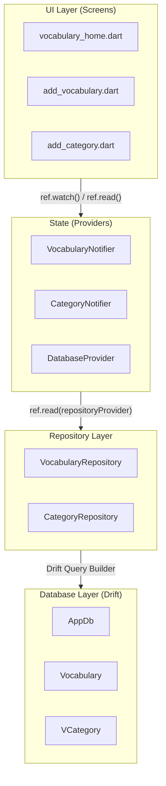
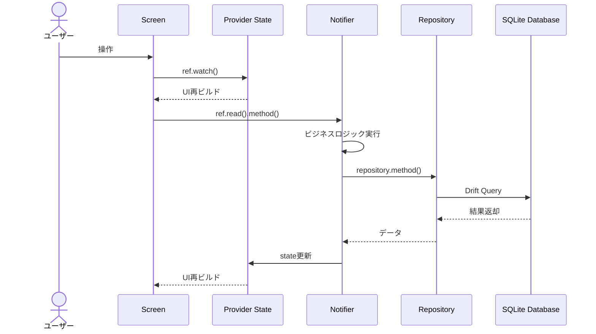
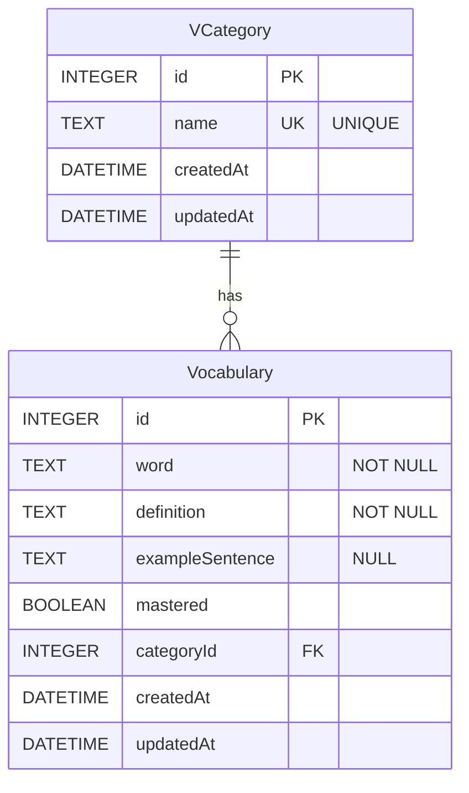

# Vocabulary Learning App

英語などの語彙を効率的に学習・管理するためのFlutterアプリケーションです。単語、定義、例文を追加・編集でき、カテゴリで整理し、習得状態を管理できます。

## 主な機能

### 語彙管理
- 単語、定義、例文の登録・編集・削除
- 習得状態（Mastered）のトグル管理
- カテゴリによる分類

### カテゴリ管理
- カテゴリの作成・編集・削除
- 重複名のバリデーション
- カテゴリ別フィルタリング

---

## 技術スタック

### 主要パッケージ

| パッケージ | バージョン | 用途 |
|-----------|-----------|------|
| [drift](https://pub.dev/packages/drift) | ^2.23.0 | SQLite ORM・データ永続化 |
| [drift_flutter](https://pub.dev/packages/drift_flutter) | ^0.2.0 | Flutter向けDrift実装 |
| [flutter_riverpod](https://pub.dev/packages/flutter_riverpod) | ^3.0.3 | 状態管理フレームワーク |
| [riverpod_annotation](https://pub.dev/packages/riverpod_annotation) | ^3.0.0 | Riverpodコード生成アノテーション |

### 開発用パッケージ

| パッケージ | バージョン | 用途 |
|-----------|-----------|------|
| [drift_dev](https://pub.dev/packages/drift_dev) | ^2.23.0 | Driftコード生成ツール |
| [build_runner](https://pub.dev/packages/build_runner) | ^2.4.13 | コード生成エンジン |
| [riverpod_generator](https://pub.dev/packages/riverpod_generator) | ^3.0.0 | Riverpodコード生成 |
| [riverpod_lint](https://pub.dev/packages/riverpod_lint) | ^3.0.0 | Riverpod用リントルール |

---

## プロジェクト構成

```
lib/
├── main.dart                       # アプリケーションエントリーポイント
│
├── database/                       # データベース層
│   ├── app_db.dart                 # Driftデータベース定義・マイグレーション
│   ├── app_db.g.dart               # 自動生成ファイル
│   └── db_tables.dart              # テーブル定義（Vocabulary, VCategory）
│
├── providers/                      # 状態管理層
│   ├── database_provider.dart      # DBシングルトンプロバイダー
│   ├── vocabulary_provider.dart    # 語彙状態管理
│   └── category_provider.dart      # カテゴリ状態管理
│
├── repositories/                   # データアクセス層
│   ├── vocabulary_repository.dart  # 語彙CRUD操作
│   └── category_repository.dart    # カテゴリCRUD操作
│
└── screens/                        # UI層
    ├── vocabulary_home.dart        # ホーム画面（一覧表示）
    ├── add_vocabulary.dart         # 語彙追加・編集画面
    └── add_category.dart           # カテゴリ追加・編集画面
```

---

## アーキテクチャ

### レイヤードアーキテクチャ

本プロジェクトは**クリーンアーキテクチャ**の原則に基づいた4層構造を採用しています。



| レイヤー | 役割 |
|---------|------|
| **UI Layer** | ユーザーインターフェース、入力処理、表示ロジック |
| **State Management** | 状態保持、ビジネスロジック、UIへの状態通知 |
| **Repository Layer** | データアクセス抽象化、CRUD操作のカプセル化 |
| **Database Layer** | SQLiteデータベース操作、マイグレーション管理 |

### データフロー



---

## データベース設計

### ER図



### Vocabularyテーブル

| カラム | 型 | 制約 | 説明 |
|--------|-----|------|------|
| `id` | INTEGER | PRIMARY KEY, AUTOINCREMENT | 語彙ID |
| `word` | TEXT | NOT NULL, LENGTH(1-255) | 単語 |
| `definition` | TEXT | NOT NULL, LENGTH(1-1000) | 定義・意味 |
| `exampleSentence` | TEXT | NULLABLE, LENGTH(1-1000) | 例文（任意） |
| `mastered` | BOOLEAN | NOT NULL, DEFAULT false | 習得フラグ |
| `categoryId` | INTEGER | NULLABLE, FOREIGN KEY | カテゴリへの参照 |
| `createdAt` | DATETIME | NOT NULL | 作成日時 |
| `updatedAt` | DATETIME | NOT NULL | 更新日時 |

### VCategoryテーブル

| カラム | 型 | 制約 | 説明 |
|--------|-----|------|------|
| `id` | INTEGER | PRIMARY KEY, AUTOINCREMENT | カテゴリID |
| `name` | TEXT | NOT NULL, UNIQUE, LENGTH(2-100) | カテゴリ名 |
| `createdAt` | DATETIME | NOT NULL | 作成日時 |
| `updatedAt` | DATETIME | NOT NULL | 更新日時 |

### マイグレーション

```dart
// スキーマバージョン: 2

// v1 → v2: categoryIdをNOT NULLからNULLABLEに変更
// カテゴリなしで語彙を作成可能にするための変更
MigrationStrategy get migration => MigrationStrategy(
  onUpgrade: (migrator, from, to) async {
    if (from < 2) {
      // 1. 新構造の一時テーブル作成
      // 2. 既存データをコピー
      // 3. 古いテーブル削除
      // 4. 一時テーブルをリネーム
    }
  },
);
```

---

## 状態管理

### Riverpod + コード生成

本プロジェクトでは `@riverpod` アノテーションによるコード生成パターンを採用しています。

### VocabularyProvider

```dart
// 状態クラス（Immutable）
class VocabularyState {
  final List<VocabularyData> vocabularies;        // 全語彙リスト
  final List<VocabularyData> filteredVocabularies; // フィルタ済みリスト
  final int? selectedCategoryId;                  // 選択中カテゴリID
  final bool isLoading;                           // ローディング状態
  final String? error;                            // エラーメッセージ

  // copyWith()で新しいインスタンスを生成して状態更新
  VocabularyState copyWith({...}) => VocabularyState(...);
}

// Notifier（ビジネスロジック）
@riverpod
class VocabularyNotifier extends _$VocabularyNotifier {
  Future<void> loadVocabularies();           // 全件読み込み
  void filterByCategory(int? categoryId);    // カテゴリフィルタ
  Future<void> addVocabulary(...);           // 追加
  Future<void> updateVocabulary(...);        // 更新
  Future<void> deleteVocabulary(int id);     // 削除
  Future<void> toggleMastered(int id, bool); // 習得状態切り替え
}
```

### CategoryProvider

```dart
class CategoryState {
  final List<VCategoryData> categories;    // 全カテゴリリスト
  final VCategoryData? selectedCategory;   // 選択中カテゴリ
  final bool isLoading;                    // ローディング状態
  final String? error;                     // エラーメッセージ
}

@riverpod
class CategoryNotifier extends _$CategoryNotifier {
  Future<void> loadCategories();
  Future<void> addCategory(...);
  Future<void> updateCategory(...);
  Future<void> deleteCategory(int id);
  void selectCategory(VCategoryData? category);
}
```

### DatabaseProvider

```dart
// keepAlive: true でアプリ全体で単一インスタンスを保持
@Riverpod(keepAlive: true)
AppDb database(Ref ref) => AppDb();
```

---

## 画面構成

### 1. ホーム画面（vocabulary_home.dart）

#### 画面構成

| エリア | 内容 |
|--------|------|
| **AppBar** | タイトル「Vocabulary Learning」+ Info ボタン |
| **カテゴリフィルター** | 横スクロール可能なチップ（All / Business / Travel / Technology ...） |
| **語彙リスト** | カード形式で単語・定義・例文・カテゴリを表示 |
| **FAB** | 「+ Add New」ボタンで新規追加画面へ遷移 |

#### カード表示例

> **apple** ✓
> りんご、果物の一種
> *"I eat an apple every day."*
> 📁 Food

**主な機能：**
- `ref.watch(vocabularyProvider)` で状態監視・自動再ビルド
- `FilterChip` によるカテゴリフィルタリング
- カードタップ → 編集画面へ遷移
- 長押し → 削除確認ダイアログ
- チェックボックス → 習得状態トグル
- 空状態・ローディング状態の表示

### 2. 語彙追加・編集画面（add_vocabulary.dart）

#### 画面構成

| エリア | 内容 |
|--------|------|
| **AppBar** | 「Add New Vocabulary」または「Edit Vocabulary」 |
| **ヘルプテキスト** | 入力ガイダンスメッセージ |
| **フォーム** | 入力フィールド群（下記参照） |
| **送信ボタン** | 「+ Add Vocabulary」ボタン |

#### フォームフィールド

| フィールド | 必須 | 説明 |
|-----------|:----:|------|
| Word | ✓ | 単語入力 |
| Definition | ✓ | 定義・意味入力（複数行） |
| Example Sentence | - | 例文入力（任意） |
| Category | - | ドロップダウンで選択 + 「+ Add New Category」リンク |
| Mastered | - | 習得済みチェックボックス |

**主な機能：**
- `ConsumerStatefulWidget` でフォーム状態管理
- `TextEditingController` による入力値制御
- バリデーション（空チェック、最小文字数）
- 新規作成/編集モードの自動判定
- カテゴリ選択（ドロップダウン）
- 習得状態チェックボックス

### 3. カテゴリ追加・編集画面（add_category.dart）

#### 画面構成

| エリア | 内容 |
|--------|------|
| **AppBar** | 「Add New Category」または「Edit Category」 |
| **説明テキスト** | カテゴリ機能の説明 |
| **フォーム** | カテゴリ名入力フィールド |
| **サンプル** | クイック選択用のサンプルカテゴリチップ |
| **送信ボタン** | 「+ Add Category」ボタン |

#### サンプルカテゴリ

`Business` `Travel` `Technology` `Food` `Medical` `Academic` `Entertainment`

**主な機能：**
- `ConsumerWidget`（ステートレス）
- カテゴリ名の重複チェック
- サンプルカテゴリのクイック選択
- `ref.invalidate()` による状態リフレッシュ

---

## セットアップ方法

### 前提条件

- Flutter SDK 3.x以上
- Dart SDK 3.10.4以上

### インストール

```bash
# リポジトリをクローン
git clone <repository-url>
cd vocabulary_learning

# 依存関係をインストール
flutter pub get

# コード生成を実行
flutter pub run build_runner build --delete-conflicting-outputs

# アプリを実行
flutter run
```

---

## 開発コマンド

### コード生成

```bash
# 一回限りのビルド
flutter pub run build_runner build --delete-conflicting-outputs

# ファイル監視モード（変更時に自動生成）
flutter pub run build_runner watch --delete-conflicting-outputs
```

### テスト実行

```bash
flutter test
```

### ビルド

```bash
# Android APK
flutter build apk

# iOS
flutter build ios

# Web
flutter build web
```

---

## コード解説

### 主要な実装パターン

#### 1. Immutable State パターン

状態クラスは不変（Immutable）として設計され、状態更新時は常に新しいインスタンスを生成します。

```dart
class VocabularyState {
  final List<VocabularyData> vocabularies;
  final bool isLoading;

  const VocabularyState({
    this.vocabularies = const [],
    this.isLoading = false,
  });

  // 状態更新は新しいインスタンスを返す
  VocabularyState copyWith({
    List<VocabularyData>? vocabularies,
    bool? isLoading,
  }) {
    return VocabularyState(
      vocabularies: vocabularies ?? this.vocabularies,
      isLoading: isLoading ?? this.isLoading,
    );
  }
}
```

**利点：**
- 状態の変更履歴追跡が容易
- 予期しない状態変更を防止
- Riverpodの状態比較が正確に動作

#### 2. 依存性注入（DI）パターン

RepositoryクラスはDatabaseインスタンスをコンストラクタで受け取ります。

```dart
class VocabularyRepository {
  final AppDb _db;

  VocabularyRepository(this._db);  // DIによる注入

  Future<List<VocabularyData>> getAllVocabularies() {
    return _db.select(_db.vocabulary).get();
  }
}

// Providerが依存関係を解決
@riverpod
VocabularyRepository vocabularyRepository(Ref ref) {
  final db = ref.watch(databaseProvider);  // DBを取得
  return VocabularyRepository(db);          // 注入
}
```

**利点：**
- テスト時にモックDBを注入可能
- 依存関係が明示的
- 単一責任の原則を遵守

#### 3. カスケード演算子（..）

Driftのクエリビルダーでメソッドチェーンを構築します。

```dart
// カテゴリIDで語彙をフィルタ
Future<List<VocabularyData>> getByCategory(int categoryId) {
  return (_db.select(_db.vocabulary)
    ..where((v) => v.categoryId.equals(categoryId)))
      .get();
}
```

**解説：**
- `..` はカスケード演算子
- `select()` の戻り値に対して `where()` を呼び出し
- 最終的に同じオブジェクトに対して `.get()` を実行

#### 4. addPostFrameCallback パターン

Widgetのビルド完了後に非同期処理を実行します。

```dart
@override
void initState() {
  super.initState();
  WidgetsBinding.instance.addPostFrameCallback((_) {
    // ビルド完了後に実行
    // Provider経由でデータを取得し、フォームを初期化
    if (widget.vocabulary != null) {
      final category = ref.read(categoryProvider).categories
          .where((c) => c.id == widget.vocabulary!.categoryId)
          .firstOrNull;
      setState(() => _selectedCategory = category);
    }
  });
}
```

**使用理由：**
- `initState()` 内で `ref.read()` を直接呼ぶと例外発生
- ビルド完了後なら安全にProviderアクセス可能

#### 5. スプレッド演算子（...）

リストを展開してWidgetツリーに追加します。

```dart
Row(
  children: [
    FilterChip(label: Text('All'), ...),
    // カテゴリリストを展開
    ...categoryState.categories.map((category) {
      return FilterChip(
        label: Text(category.name),
        selected: selectedId == category.id,
        onSelected: (selected) { ... },
      );
    }),
  ],
)
```
